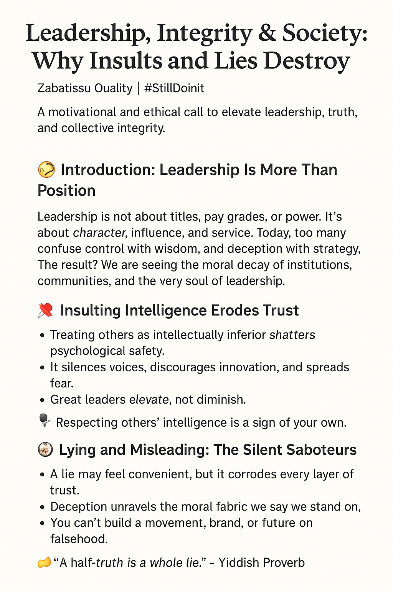

# Daily-Motivation
✨ A physics-meets-purpose motivational series that blends science, mindset, and inspiration. Each post helps you raise your vibration — in energy, in thought, in life. Powered by #StillDoinIt and Zabatissu Vibes.

# 🌅 Daily Motivation: Raise Your Vibration — Like Physics Demands It ⚛️✨

Welcome to the **Daily Motivation** repository — where science meets spirit, and frequency meets focus.

This project blends the power of physics with personal growth to help you start each week with elevated energy and intentional mindset.

---

## 📄 Feature PDF: "Raise Your Vibration — The Physics of Personal Growth"

> “To raise your vibration is to energize your potential.”  
> You are energy in motion. Operate at your highest frequency.

📥 [Click here to download the full PDF](./Raise-Your-Vibration-The-Physics-of-Personal-Growth.pdf)

---

## 🎯 What’s Inside

- 🎸 Physics of vibration: From strings to lightwaves  
- 🧘🏽‍♀️ Metaphors in life: From doubt to drive  
- 💡 Mindset shifts: Courage, focus, progress  
- ⚛️ A call to action: You are a wave, not a particle

---

## 🌍 Why It Matters

In a world full of noise, it's time to tune your own frequency. Whether you're an engineer, artist, teacher, or leader — raising your vibration leads to deeper **impact** and **clarity**.

---

## 🔁 Join the Vibration Movement

Let’s elevate our energy, mind, and mission — one Monday at a time.

#ElevateYourFrequency  
#StillDoinIt 🔁  
#VibrateHigher  
#MotivationMonday  
#ScienceMeetsSoul  
#ZabatissuVibes  
#EnergyInMotion  
#GammaAppPresentation  
#MindsetMatters  
#ConsciousLeadership  

---

# 🧠 Daily Motivation Feature: Leadership, Integrity & Society

_A motivational and ethical call to elevate leadership, truth, and collective integrity._

---

---
"Leadership, Integrity & Society: Why Insults and Lies Destroy"
author: "Zabatissu Quality | #StillDoinIt"
description: "A motivational and ethical call to elevate leadership, truth, and collective integrity."
---

# 🧠 Daily Motivation Feature: Leadership, Integrity & Society

## 🎯 Introduction: Leadership Is More Than Position

Leadership is not about titles, pay grades, or power. It's about **character, influence, and service**. Today, too many confuse control with wisdom, and deception with strategy. The result? We are seeing the **moral decay of institutions**, communities, and the very soul of leadership.

---

## ❌ Insulting Intelligence Erodes Trust

- Treating others as intellectually inferior **shatters psychological safety**.
- It silences voices, discourages innovation, and spreads fear.
- Great leaders **elevate**, not diminish.

📌 *Respecting others’ intelligence is a sign of your own.*

---

## 🧨 Lying and Misleading: The Silent Saboteurs

- A lie may feel convenient, but it **corrodes every layer of trust**.
- **Deception unravels the moral fabric** we say we stand on.
- You can't build a movement, brand, or future on falsehood.

🗣️ *“A half-truth is a whole lie.” – Yiddish Proverb*

---

## 🧭 Bad Character Corrupts Morals

- Small unethical acts become systemic if unchecked.
- **Rot at the top seeps downward**, infecting culture and behavior.
- Accountability starts with example. A compass with no north leads nowhere.

📌 *True power lies in consistency between values and actions.*

---

## 🔁 What Real Leadership Requires

- **Humility** to listen before judging  
- **Courage** to speak truth even when it's hard  
- **Empathy** to understand before reacting  
- **Conviction** to model what you expect from others  

---

## 🧩 A Call to Elevate

This isn’t just critique — it’s a **call to rise**. Let’s stop glorifying manipulative behavior masked as leadership. Let’s:

- Build with truth 🧱  
- Lead with purpose 🕊️  
- Serve with empathy 💡  

🎙️ *Let’s raise the vibration. Let’s elevate the mindset. Let’s transcend the nonsense.*

---

## 💬 Closing Quote

> "Character is how you treat those who can do nothing for you." — Johann Wolfgang von Goethe

Let’s be **builders, not breakers**. That’s Zabatissu Quality. That’s #StillDoinIt.

---

## 🔗 Hashtags & Movement

#Leadership #Accountability #CharacterMatters #TruthAndIntegrity  
#ZabatissuQuality #ElevateAscendTranscend #StillDoinIt

---

📌 Save. Share. Speak truth boldly.  
📂 Powered by Daily Motivation + Zabatissu Vibes.

---

## 🌄 Daily Motivation — "To Be is to Matter"

> "Do you have to exist to be — or be to exist?"

In a world chasing visibility, this reflection reminds us:
- You *are* when you dream, love, and speak truth.
- Recognition may follow, but it does not define your worth.
- Existence is not just form — it's **presence**, **intention**, and **becoming**.

🎴 [View the Gamma Presentation](To-Be-is-to-Matter.pdf)  
📄 [Download the PDF](To-Be-is-to-Matter.pdf)

**You matter before the world notices.**  
**You are because you *be*.**

---

#stilldoinit • #ZabatissuThoughts • #ElevateAscendTranscend  
🦁🐢⚖️

---
## 🔥 Daily Motivation: *Live Bold. Be You. No Permission Needed.*

> 💬 *"You don’t need permission to breathe—so why wait to live your purpose?"*

This motivational piece challenges limiting beliefs, ignites self-worth, and calls for unapologetic authenticity. It’s a call to:
- 💡 Explore your depth  
- 🌟 Expand your impact  
- 🚀 Elevate your life  

🔑 **You don’t need permission to be great. You just need to show up—fully, boldly, now.**

✨ This is the [**Zabatissu mindset**](https://jemaelnzihou.github.io/Portfolio/index.html) — We rise. We move. We’re #StillDoinIt.

📄 [**Read the full Daily Motivation (PDF)**](Live-Bold-Be-You-No-Permission-Needed.pdf)

---

> 🧬 *You were born with encoded greatness—Creativity, Passion, Resilience, Potential. Don’t play small. Own your truth. Be limitless.*

#Zabatissu #NoPermissionNeeded #DailyMotivation #UnlockYourPotential #LiveYourPurpose #StillDoinIt #ElevateAscendTranscend

---

Here’s a professional and motivational `README.md` for your GitHub repository, tailored to the content of your PDF and the Zabatissu mindset:

---

# 📖 I Am My Freedom: A Sartrean Call to Live Intentionally

Welcome to the **Daily Motivation** repository — a space dedicated to intentional living, existential empowerment, and daily doses of self-mastery. This project is built around the powerful idea:  
> **“I am my freedom.” – Jean-Paul Sartre**

## 🔥 About This Project

This repository features the presentation:  
📘 **I Am My Freedom: A Sartrean Call to Live Intentionally**  
A motivational breakdown of how existential philosophy can inspire real-life choices, confidence, and purpose in a world full of labels and limitations.

---

## 📌 Key Messages

- You are **not your past**
- You are **not your label**
- You are **your next decision**
- **Freedom** is your essence — not something you wait for, but something you *are*

This philosophy is the heartbeat of **Zabatissu**:  
> **Elevate. Ascend. Transcend.**

---

## 📂 Contents

- [`I-Am-My-Freedom-A-Sartrean-Call-to-Live-Intentionally.pdf`](./I-Am-My-Freedom-A-Sartrean-Call-to-Live-Intentionally.pdf) – Full presentation
- 🔜 Future posts, visual reflections, and motivational thoughts in markdown and image formats

---

## 🚀 Purpose

This repo is a living archive of daily motivation inspired by philosophy, self-discipline, and the belief that **you don’t need permission to live your purpose**. Whether you're a creator, a student, a veteran, or just looking to reawaken your spirit—this is for you.

---

## 💡 Get Involved

- ⭐ Star this repo to follow future reflections and uploads
- 💬 Share your favorite quote or personal philosophy via Issues or Discussions
- 🔄 Fork the repo to remix your own motivational journal or digital zine

---

## 📎 Connect

For more content, visit:
🔗 [LinkedIn](https://www.linkedin.com/in/jemaelnzihou)  
📌 [Daily Motivation GitHub](https://github.com/jemaelnzihou/Daily-Motivation)

---

### #StillDoinIt  
**Don’t just exist. Be. Choose. Live.**  

---

# 🌱 Understanding Our True Nature

> A motivational reflection on identity, character, and the power of context  
> _“You are not a fixed script. You are the author. Choose your story wisely.”_

---

## 📘 Understanding-Our-True-Nature

Focuses on how character is shaped by **situational context**, not merely fixed traits. It was adapted into a daily motivation. 

This includes:
- 📄 A visual 7-slide **PDF presentation** summarizing the concept
- 🧠 Philosophical insights blended with real-life applications
- 💡 A call to action encouraging personal growth and transformation

---

## 🔑 Key Themes Covered

1. **The Myth of Fixed Character**  
   Breaks the illusion that personality is permanent or absolute.

2. **The Power of Situations**  
   Draws on psychological experiments (e.g. Zimbardo, Milgram) to highlight environmental influence.

3. **Limitless Potential**  
   Emphasizes our ability to change, grow, and redefine ourselves.

4. **Small Changes, Big Impact**  
   Shows how even trivial experiences can shift behavior.

5. **Question What Defines You**  
   Encourages self-awareness over superficial identity labels.

6. **You Are the Story You Choose to Live**  
   Empowers the idea that we write our own narrative every day.

7. **Zabatissu Philosophy**  
   Invites the reader to **Elevate. Ascend. Transcend.**  
   #StillDoinIt

---

## 📂 Files

| File | Description |
|------|-------------|
| `Understanding-Our-True-Nature.pdf` | Daily motivational presentation based on character psychology |

---

## 📣 Get Involved

Feel free to:
- ⭐ Star this repo if the message resonates with you
- 🛠 Adapt the content into your own motivational themes or slides
- 💬 Share your story or interpretation of personal growth

---

## 🙌 Final Message

> "You are not your labels. You are your actions—moment by moment. Choose to become the best version of yourself."

**Embrace the Zabatissu Concept**  
**Elevate. Ascend. Transcend.**  
#StillDoinIt

